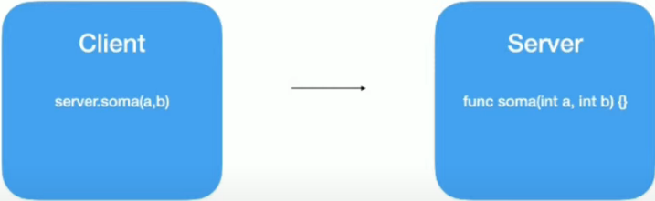
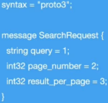

# gRPC vs REST na prática

### [gRPC](https://grpc.io/)

* **Definição**

  

  > RPC = (R)emote (P)rocedure (C)all

  * É um framework desenvolvido pela Google

  * Tem o objetivo de facilitar o processo de comunicação entre sistemas de uma forma extremamente rápida, leve, independente de linguagem

  * Faz parte da CNCF (Could Native Computing Foundation)

* **Casos de uso**

  * Ideal para microsserviços

  * Mobile, browsers e back-end

  * Geração das bibliotecas de forma automática (**stubs**)

  * Streaming bidirecional utilizando HTTP/2 (rodam em binários e pode ser trabalhado com _streams_)

* **Linguagens (Suporte oficial)**

  * **gRPC-GO**

  * **gRPC-JAVA**

  * **gRPC-C**

  * **OBS**: as outras linguagens (Kotlin, NodeJS, Ruby) possuem extensões baseada no **gRPC-C**

* **Protocol Buffers**

  * **Definição**

    * Linguagem neutra do Google
    
    * Mecanismo extensivo para serialização de estrutura de dados

    * Mas rápido, inteligente e simplificado do que o XML/JSON

  * **Protocol Buffers vs JSON**

    * Arquivos binários < JSON (plain text)

    * Processo de serialização é mais leve (CPU) do que JSON

    * Gasta menos recursos de rede

  * **Estrutura**

    

    > 1, 2, 3 são Tags do Protocol Buffers

* **HTTP/2**

    * Nome original cirado pela Google era SPDY

    * Lancado em 2015

    * Dados trafegados são binários e não texto como no HTTP 1.1

    * Utiliza a mesma conexão TCP para enviar e receber dados do cliente e do servidor (Multiplex)

    * _Server Push_

    * _Headers_ são comprimidos

    * Gasta menos recurso de rede

    * Processo é mais veloz

* **Tipos de gRPC**

  * **gRPC - API "unary"**

    

  * **gRPC - API "Server streaming"**

    

  * **gRPC - API "Client streaming"**

    

  * **gRPC - API "Bi directional streaming"**

    

* **REST vs gRPC**

  * **REST**

    * Texto / JSON

    * Unidirecional

    * Alta latência

    * Sem contrato (maior chance de erros)

    * Sem suporte a streaming (Request / Response)

    * Design pré-definido

    * Biblioteca de terceiro

  * **gRPC**

    * Protocol Buffers

    * Bidirecional e assíncrono

    * Baixa latência

    * Contrato definido (`.proto`)

    * Suporte a streaming

    * Design é livre

    * Sem dificuldades de implementação de bibliotecas de terceiros (**geração de códigos**)